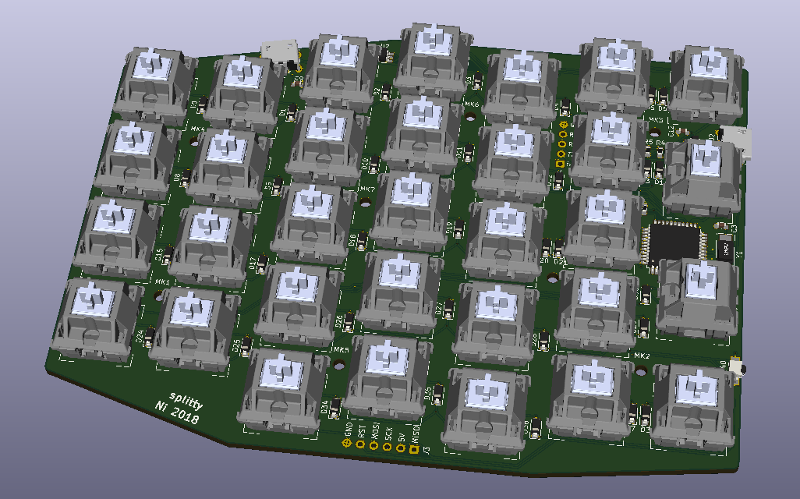

Splitty
=======

This is a split ergonomic keyboard based on the Ergodox layout without the
thumb cluster. It uses 32 keys per sides with Cherry MX compatibles switches,
thirty 1u and two vertical 1.5u caps.

The controller is integrated in order to make the keyboard as slim as
possible.

It connects to the computer using a micro-B USB. Both sides are connected
together also using micro-B USB. Any connection mistake should not break
anything and the keyboard supports hot plugging.

BOM
---

All prices in euro.

Here is what is needed for one half, with references at Farnell and LCSC for
some parts.

| Quantity | Designator   | Description                              | Farnell   | Price | Total | LCSC    | Price  | Total |
| -------: | ------------ | ---------------------------------------- | --------: | ----: | ----: | ------: | -----: | ----: |
|       32 | SW0-38       | Cherry MX switches                       |           |       |       |         |        |       |
|        3 | C1, C11, C12 | Capacitor 0603 1μF >6V X7R               |   2346895 | 0.055 | 0.165 |  C93816 | 0.0172 | 0.052 |
|        2 | C3, C4       | Capacitor 0603 10pF >6V C0G/NP0          |   2496879 | 0.013 | 0.026 | C106245 | 0.0084 | 0.017 |
|        6 | C5-10        | Capacitor 0603 100nF >6V X7R             |   2320803 | 0.037 | 0.222 | C187860 | 0.0231 | 0.139 |
|       32 | D0-38        | Diode SOD-123                            |   2760402 | 0.079 | 2.528 |  C83528 | 0.0091 | 0.291 |
|        2 | J1,J2        | Connector USB Micro-B Würth 629105150521 |   2470822 | 1.360 | 2.720 |         |        |       |
|        2 | R1, R2       | Resistor 0603 22Ω                        |   9331891 | 0.002 | 0.004 |         |        |       |
|        3 | R3, R4, R5   | Resistor 0603 4.7kΩ                      |   9332154 | 0.002 | 0.006 |         |        |       |
|        1 | SW40         | Tactile Switches Omron B3U-3000P-B       |   1333656 | 0.420 | 0.420 |         |        |       |
|        1 | U1           | ATmega32U4-AU                            |   2443182 | 3.570 | 3.570 |  C44854 | 3.1513 | 3.151 |
|        2 | U2, U3       | ST USBLC6-2SC6                           |   1269406 | 0.313 | 0.626 |   C7519 | 0.1456 | 0.291 |
|        1 | Y1           | Crystal Abracon ABM3 16MHz               |   1611806 | 0.660 | 0.660 |         |        |       |
|        8 |              | M2 screw, 6mm                            |   1420386 | 0.012 | 0.094 |         |        |       |
|       16 |              | M2 nuts                                  |   1419445 | 0.009 | 0.150 |         |        |       |
|          |              |                                          |           | Total | 11.19 |         |        |       |
|          |              |                                          |           |    x2 | 22.38 |         |        |       |

Boards were ordered at JLCPCB, you can ask for delivery of JLCPCB and LCSC
orders in the same package.

| Description                   | JLCPCB by | Price | Unit  | JLCPCB by | Price | Unit  |
| ----------------------------- | --------- | ----- | ----- | --------- | ----- | ----- |
| Printed Circuit Board (green) |         5 | 11.25 | 2.250 |        10 | 15.20 | 1.520 |
| Front Plate (white)           |         5 | 18.55 | 3.710 |        10 | 22.49 | 2.249 |
| Back Plate (white)            |         5 | 18.55 | 3.710 |        10 | 22.49 | 2.249 |

My actual orders
----------------

Cool Jazz (AliExpress):

 - 92 Gateron MX brown switches: 21.93 €
 - Ergodox PBT blank keycaps (60 1u, 16 1.5u, 4 2u): 23.12 €
 - Total: 45.05 €

Farnell:

 - 4 connector USB: 5.44 €
 - 2 quartz: 1.32 €
 - 100 screws: 1.17 €
 - 100 nuts: 0.94 €
 - Shipping: 6.90 €
 - Taxes: 3.16 €
 - Total: 18.93 €

JLCPCB + LCSC:

 - 5 PCB: 11.25 €
 - 5 Front Plate: 18.55 €
 - 5 Back Plate: 18.55 €
 - Shipping (JLCPCB, DHL): 5.03 €
 - 10 ST USBLC6: 0.72 €
 - 4 ATmega32U4: 12.59 €
 - 140 diodes: 1.27 €
 - 50 1uF capacitors: 0.86 €
 - Shipping (LCSC): 0.17 €
 - Taxes + DHL tip(!): 27 €
 - Total: 95.99 €

Personal stock:
 - Some resistors and capacitors.

I have enough components for two keyboards except USB connectors, quartz
(forgotten in Farnell order), switches and caps (they will probably be
different), and an extra set of boards.

Grand total: 159.97 €

Grand total (for one keyboard): 111.98 €

License
-------

Copyright (C) 2018 Nicolas Schodet

Permission is hereby granted, free of charge, to any person obtaining a copy
of this software and associated documentation files (the "Software"), to deal
in the Software without restriction, including without limitation the rights
to use, copy, modify, merge, publish, distribute, sublicense, and/or sell
copies of the Software, and to permit persons to whom the Software is
furnished to do so, subject to the following conditions:

The above copyright notice and this permission notice shall be included in all
copies or substantial portions of the Software.

THE SOFTWARE IS PROVIDED "AS IS", WITHOUT WARRANTY OF ANY KIND, EXPRESS OR
IMPLIED, INCLUDING BUT NOT LIMITED TO THE WARRANTIES OF MERCHANTABILITY,
FITNESS FOR A PARTICULAR PURPOSE AND NONINFRINGEMENT. IN NO EVENT SHALL THE
AUTHORS OR COPYRIGHT HOLDERS BE LIABLE FOR ANY CLAIM, DAMAGES OR OTHER
LIABILITY, WHETHER IN AN ACTION OF CONTRACT, TORT OR OTHERWISE, ARISING FROM,
OUT OF OR IN CONNECTION WITH THE SOFTWARE OR THE USE OR OTHER DEALINGS IN THE
SOFTWARE.
