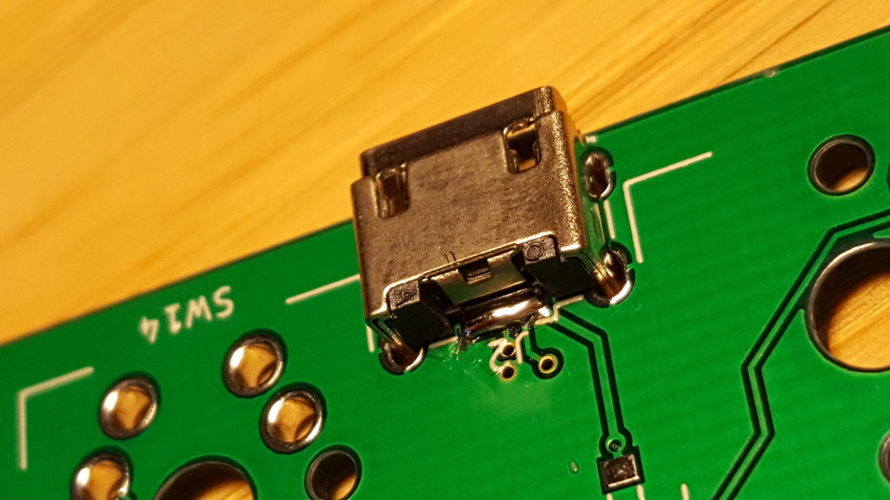
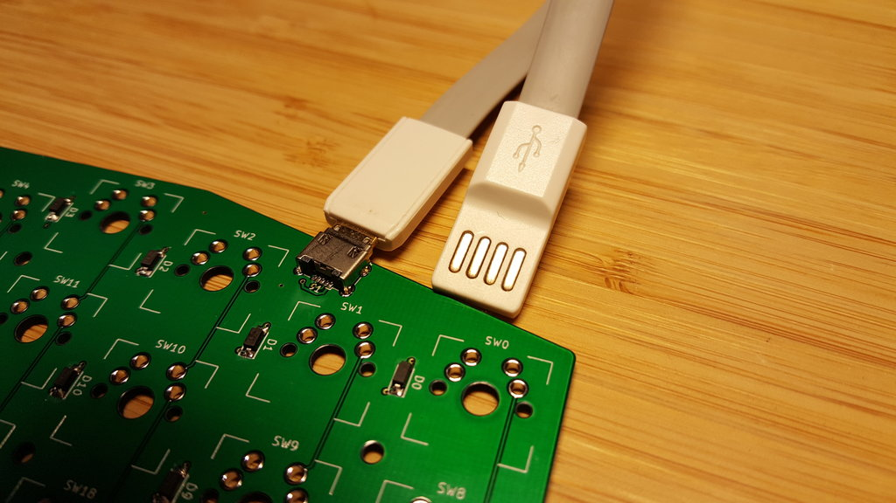

Build log
=========

Here are my tools used to solder the splitty:

- a simple soldering iron (with a quite large tip),
- solder (make sure the iron temperature matches the solder),
- a metallic sponge,
- solder wick (for fast SMD soldering),
- tweezers.

Also not shown on the picture:

- a small screwdriver,
- a 4 mm wrench or pliers,
- a flush cutter,
- a conductivity tester,
- a magnifier,
- glue (cyanoacrylate).

OK, let’s start.

The PCB is the same for both halves, one will have components on top and the
other on the bottom face.

Some components can be soldered on any face:

- the switches of course,
- diodes can be soldered on any face, choose your side,
- connectors and reset switch are supposed to be soldered on the top face,
- only one of C11 or C12 need to be soldered, choose one.

Lay down PCBs side by side to avoid silly mistakes:

First components to solder are the diodes, check the polarity, the thin line
on the component corresponds to the cathode and must be oriented on the side
with the longer line on the silkscreen.

The technique to solder small components is always the same, apply some solder
on one pad on the PCB, then press the component against the board and heat its
leg and your solder pad. The component will sink into the solder. Then, apply
solder to the other side while heating both the pad and the leg.

If one side is connected to a copper plane, choose this pad as the first one.
If you don’t, there is a risk that the first pad solder will melt while you
try to heat the pad connected to the plane.

Next component to solder is the micro USB socket as this is the trickiest part
to solder.

Start with the same technique used for the diodes. Apply solder on one pad,
choose the pad connected to the ground plane. Push the connector into place
while heating its leg and the pad and check the alignment is correct.

Then I use a surprising technique which works really well for components with
small pitch: apply solder to all pads and legs, with proper heating to both
the pads and the legs as always. All the pads… as the same time… there will be
shorts.

Now, put the solder wick above the contacts, apply a little drop of solder on
the tip of your iron to improve heat transfer, then press it firmly against
the wick for two seconds. Most solder will be sucked by the solder wick and
only a sufficient amount on solder will stay, removing any shorts while still
ensuring a good contact.

Now solder the large legs to ensure good mechanical support.

Test your connections, this is easy with this kind of cable, you can even
apply some force on the connector and see if the connection is rock solid:

Soldering the rest of the components is a piece of cake, but keep things
organized:

(TODO: make a video of how easy it is to solder a ATMEGA32u4).

The splitty does not use spacers, and you need to prepare screws now before
the front plate is attached.

Here is a schematic of the attachment:

Before the switches and therefore the front plate are mounted, you need to
install the screws and the first nuts. A nut is temporary used on the other
side so that the screw does not fall during the preparation.

Now it is time to test *every* connections. Repairing a connection (especially
on the left hand half) will be much harder once the front plate is installed!

First start with the corner switches so that the front plate is leveled.

Then proceed with the other switches.

I started with the right side so a mistake can be fix more easily.

To glue the nuts to the bottom plate, use a screw to hold the nut in place.

Apply glue around every nuts and remove the screw before the glue has
completely dried.

Depending on your switches and nuts, you may need to cut a little bit of the
switches legs. Another solution is to add enough washers so that is not
needed.

For the final assembly, you can not screw every screw one after the other, you
need to turn one turn on every screws, then repeat until every screws are
tighten.

Well done:

