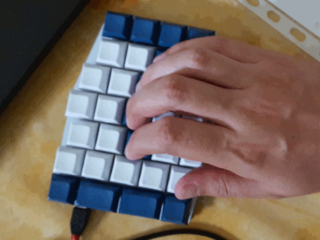
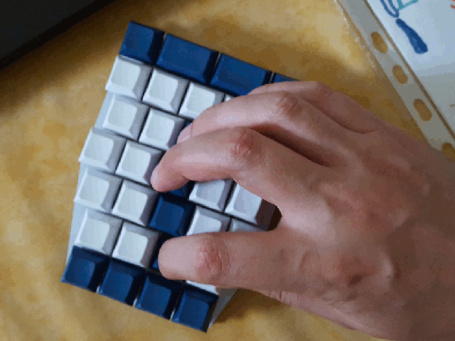

FAQ
===

Why is the inner index column staggered up?
-------------------------------------------

Because I find it more comfortable to extend the index to the side and up
rather than straight to the side.

A right hand on a left splitty half to simulate the other stagger:

I am not alone, the same arrangement is used on the [mitosis][] for example.

It is also the case of a strange keyboard that a lot of people uses, as the
arm come from the side, the inner row is actually shifted up:

[mitosys]: https://www.reddit.com/r/MechanicalKeyboards/comments/66588f/wireless_split_qmk_mitosis/
